# DissignasLabyrint - Dokumentation

## Systemöversikt

## Klassstruktur
Systemet består av följande huvudkomponenter:

### Spelflöde
- **GameSession**: Orkestrerare för en spelomgång — kopplar ihop labyrint, rendering, UI, poäng, utforskning och power-ups.
- **StartScreen**: Startskärm med val mellan nivåläge (strukturerad progression) och fritt spel. Visar inställningar för labyrintstorlek, svårighetsgrad och tidsgräns.
- **VictoryScreen**: Segerskärm med stjärnbetyg, utforskningsstatistik och bonuspoäng.

### Labyrint
- **MazeGenerator**: Genererar labyrintlayouten med rekursiv backtracking.
- **MazeLogic**: Hanterar spelstatus, rörelse och händelser.
- **MazeRenderer**: 3D-rendering med Three.js — väggar, golv, besökta celler, power-ups och visuella teman.

### Spelare
- **Player**: Representerar spelarens position och 3D-mesh.
- **PlayerLogic**: Ren tillståndshantering för spelarens position.

### Utforskning & betyg
- **ExplorationTracker**: Spårar besökta celler och beräknar utforskningsprocent.
- **StarRating**: Rena funktioner för stjärnbetyg (1–3 stjärnor) och utforskningsbonus.

### Teman
- **themes.ts**: Tre visuella teman (Stone Dungeon, Forest, Space Station) som roterar per nivågrupp eller labyrintstorlek i fritt spel.

### Frågor & poäng
- **QuestionGenerator**: Genererar svårighetsanpassade matematikfrågor.
- **ScoreTracker**: Poäng, svit och träffsäkerhet.
- **StatsManager**: Persistent statistik, highscores och bästa stjärnbetyg (localStorage).

### Power-ups
- **PowerUpManager**: Placering och insamling av power-ups (ledtråd, tidsbonus, poängmultiplikator).

### Övrigt
- **GameTimer**: Nedräkningstimer.
- **SoundManager**: Procedurell ljud (Web Audio API).
- **TranslationService**: Internationalisering med stöd för 5 språk (sv, en, no, fi, da).
- **Operation**: Gränssnitt för matematikoperationer (Addition, Subtraction, Multiplication, Division, Modulo, Power).